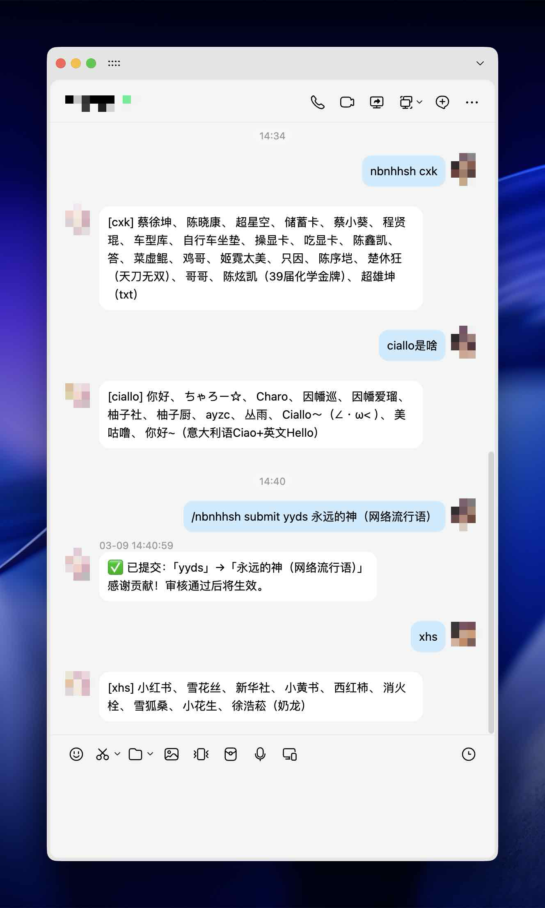
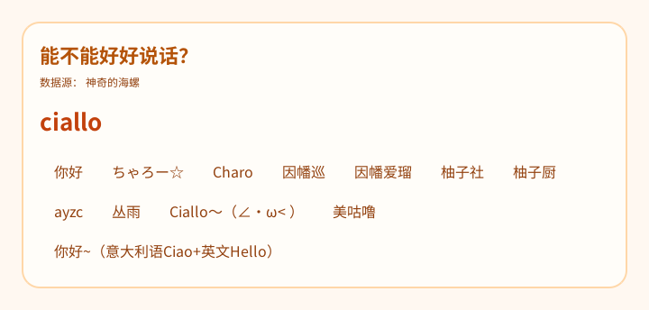

<div align="center">
    <a href="https://v2.nonebot.dev/store">
    </a>

## ✨ nonebot-plugin-nbnhhsh ✨
[](./LICENSE)
[](https://pypi.python.org/pypi/nonebot-plugin-nbnhhsh)
[](https://www.python.org)
[](https://github.com/astral-sh/uv)
<br/>
[](https://github.com/astral-sh/ruff)
[](https://results.pre-commit.ci/latest/github/ByteColtX/nonebot-plugin-nbnhhsh/master)

</div>

## 📖 介绍

「能不能好好说话？」—— 拼音首字母缩写翻译插件。

看不懂群友在说什么？直接问 bot 就行。支持主动查询、自然语言问句触发，以及开启后的自动划词翻译。数据来源：[itorr/nbnhhsh](https://github.com/itorr/nbnhhsh)。

## 🎨 效果图





## 💿 安装

<details open>
<summary>使用 nb-cli 安装</summary>
在 nonebot2 项目的根目录下打开命令行, 输入以下指令即可安装

    nb plugin install nonebot-plugin-nbnhhsh --upgrade
使用 **pypi** 源安装

    nb plugin install nonebot-plugin-nbnhhsh --upgrade -i "https://pypi.org/simple"
使用**清华源**安装

    nb plugin install nonebot-plugin-nbnhhsh --upgrade -i "https://pypi.tuna.tsinghua.edu.cn/simple"


</details>

<details>
<summary>使用包管理器安装</summary>
在 nonebot2 项目的插件目录下, 打开命令行, 根据你使用的包管理器, 输入相应的安装命令

<details open>
<summary>uv</summary>

    uv add nonebot-plugin-nbnhhsh
安装仓库 master 分支

    uv add git+https://github.com/ByteColtX/nonebot-plugin-nbnhhsh@master
</details>

<details>
<summary>pdm</summary>

    pdm add nonebot-plugin-nbnhhsh
安装仓库 master 分支

    pdm add git+https://github.com/ByteColtX/nonebot-plugin-nbnhhsh@master
</details>
<details>
<summary>poetry</summary>

    poetry add nonebot-plugin-nbnhhsh
安装仓库 master 分支

    poetry add git+https://github.com/ByteColtX/nonebot-plugin-nbnhhsh@master
</details>

打开 nonebot2 项目根目录下的 `pyproject.toml` 文件, 在 `[tool.nonebot]` 部分追加写入

    plugins = ["nonebot_plugin_nbnhhsh"]

</details>

<details>
<summary>使用 nbr 安装(使用 uv 管理依赖可用)</summary>

[nbr](https://github.com/fllesser/nbr) 是一个基于 uv 的 nb-cli，可以方便地管理 nonebot2

    nbr plugin install nonebot-plugin-nbnhhsh
使用 **pypi** 源安装

    nbr plugin install nonebot-plugin-nbnhhsh -i "https://pypi.org/simple"
使用**清华源**安装

    nbr plugin install nonebot-plugin-nbnhhsh -i "https://pypi.tuna.tsinghua.edu.cn/simple"

</details>


## ⚙️ 配置

在 nonebot2 项目的`.env`文件中添加下表中的必填配置

| 配置项  | 必填  | 默认值 |   说明   |
| :----- | :---: | :----: | :------ |
| `NBNHHSH_AUTO` | 否 | `false` | 开启自动划词翻译，bot 会自动识别消息中的缩写并回复 |
| `NBNHHSH_AUTO_MIN_LEN` | 否 | `2` | 自动划词触发的最短缩写长度 |
| `NBNHHSH_TIMEOUT` | 否 | `10` | 设置 HTTP 请求的超时时间（秒） |
| `NBNHHSH_TEXT2PIC` | 否 | `false` | 是否将翻译结果以图片形式发送，避免因敏感词导致消息无法发送 |

同时需要在 `.env` 中配置命令分隔符（空格）以支持子命令：

```
COMMAND_SEP=[" ", "."]
```

## 🎉 使用
### 指令表
| 指令  | 权限  | 需要@ | 范围  |   说明   |
| :--- | :---: | :---: | :---: | :------ |
| `/nbnhhsh <缩写>` | 群员 | 否 | 群聊/私聊 | 翻译缩写，别名：`/好好说话` `/hhsh` `/缩写` |
| `/nbnhhsh submit <缩写> <文字>` | 群员 | 否 | 群聊/私聊 | 提交缩写的对应文字，审核通过后生效 |
| 自然语言问句 | 群员 | 否 | 群聊/私聊 | 发送「xx是什么」「xx是啥」「xx啥意思」等自动触发查询 |

### 自然语言触发示例

以下问法均可触发查询，无需命令前缀：

```
yyds是什么
gkd是啥
nbcs啥意思
yyds是什么意思
```

### 自动划词

开启 `NBNHHSH_AUTO=true` 后，bot 会自动识别消息中出现的缩写并翻译，只回复有实际翻译结果的词条，暂未录入的词条不会触发回复。

